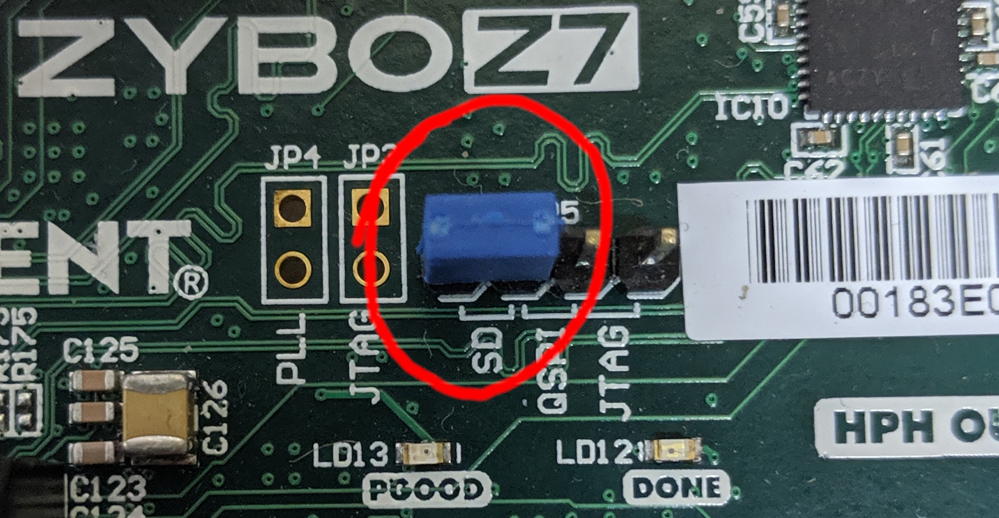
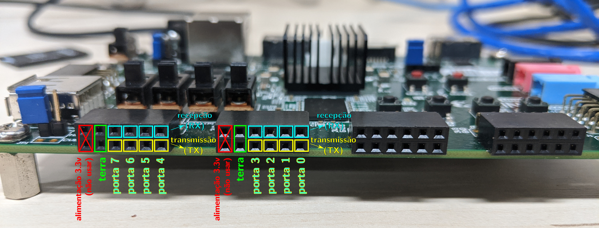
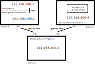

# Introdução

Neste trabalho, vamos juntar todas as camadas que implementamos até agora e depois testar o funcionamento em uma rede física real!


# Por que o grupo é maior que o das práticas anteriores?

Para vocês terem a liberdade de testar várias implementações diferentes de P1, P2, P3 e P4, afinal esse trabalho consiste em juntar as diversas camadas.

As implementações não precisam estar perfeitas para funcionarem em conjunto:

 * Teoricamente, uma implementação de TCP passando até o teste do Passo 3 é suficiente para estabelecer uma conexão, trocar dados e comprovar o funcionamento. Uma implementação de TCP passando até o teste do Passo 4 deve funcionar quase perfeitamente, pois a nossa camada física é bastante confiável e tem probabilidade baixíssima de perder ou corromper pacotes.

 * Uma implementação de IP passando até o teste do Passo 3 deve funcionar bem se você não alterar as tabelas de encaminhamento fornecidas (se alterar, o Passo 4 é importante para evitar loops de roteamento). Você só vai precisar do Passo 5 do IP se quiser testar o mtr ou traceroute.

No entanto, a implementação de vocês pode ter erros que, por azar, não foram exercitados pelos testes automatizados. Portanto, dica valiosa: testem todas as combinações possíveis de implementações dos seus integrantes, até funcionar.


# Por que a Zybo Z7-20 e não um PC?

Nós configuramos a Zybo Z7-20 para disponibilizar 8 interfaces seriais em cada placa. Assim, conseguimos montar redes usando uma camada física simples e fácil de entender.


# Compartilhando a Internet com as placas

> Esta seção é **opcional**, mas **recomendada**: com o computador servindo como roteador, fica muito mais fácil copiar arquivos para as placas (via `scp`) e depurar problemas (acesso SSH sem depender do cabo USB serial).

## No Linux (NetworkManager)

Conecte uma porta Ethernet do computador a uma porta Ethernet da placa. Crie uma conexão cabeada do tipo "Compartilhada com outros computadores" (*Shared with other computers*) no NetworkManager.

**Pela interface gráfica:**

1. Abra as **Configurações de Rede**.
2. Em "Cabeado" (*Wired*), clique em **+** para adicionar um novo perfil.
3. Na aba **IPv4**, selecione o método **Compartilhada com outros computadores**.
4. Salve.

**Pela linha de comando com `nmcli`:**

```bash
nmcli con add type ethernet ifname eth0 con-name "Compartilhada" ipv4.method shared
```

Substitua `eth0` pelo nome da interface Ethernet ligada à placa (você pode descobrir o nome com `ip link` ou `nmcli dev`).

Com o método `shared`, o NetworkManager ativa um servidor DHCP (dnsmasq) na interface, atribui um IP à placa e configura NAT para que a placa tenha acesso à rede do seu computador.

### Monitorando os IPs atribuídos pelo DHCP

Em vez de conectar via USB serial e executar `ip addr` para descobrir qual IP a placa pegou, basta consultar os *leases* do servidor DHCP do NetworkManager como *root*:

```bash
cat /var/lib/NetworkManager/dnsmasq-*.leases
```

A saída mostra uma linha por *lease*, com *timestamp*, endereço MAC, endereço IP e nome do host:

```
1719876543 aa:bb:cc:dd:ee:ff 192.168.200.4 alarm *
```

## No Windows

No Windows, o *Internet Connection Sharing* (ICS) é configurado de forma **diferente**: você deve ativá-lo nas propriedades da placa que **tem** a Internet (ex.: Wi-Fi), e não na placa que vai compartilhar a conexão — ou seja, o caminho é o contrário do Linux.

Para configurar:

1. Abra o **Painel de Controle** → **Central de Rede e Compartilhamento** → **Alterar as configurações do adaptador**.
2. Clique com o botão direito na placa **que tem acesso à Internet** (ex.: Wi-Fi) → **Propriedades**.
3. Vá até a aba **Compartilhamento**.
4. Marque **"Permitir que outros usuários da rede se conectem através da conexão de Internet deste computador"**.
5. Na lista suspensa, selecione a interface Ethernet que está ligada à placa Zybo.
6. Confirme.

O Windows atribuirá automaticamente o IP `192.168.137.1` à placa Ethernet e iniciará um servidor DHCP na rede `192.168.137.0/24`. A placa Zybo receberá um IP nessa faixa (tipicamente `192.168.137.2`).

### Visualizando os IPs atribuídos

O Windows ICS não expõe um arquivo de *leases* como o dnsmasq. A forma mais prática de descobrir quais IPs estão em uso é consultar a tabela ARP no **Prompt de Comando**:

```cmd
arp -a
```

Procure pelos IPs na faixa `192.168.137.x`.

# Ligando e acessando a placa

A placa pode ser alimentada pela USB. Ela deve ter vindo com um cartão MicroSD com o Arch Linux instalado. Caso você precise gerar seu próprio cartão SD, baixe os arquivos necessários [aqui](https://drive.google.com/drive/folders/16zI8pdwchCyDzh5aTEpsT2GYh57uJ2OQ?usp=sharing) e execute o script `sdcard_format.sh` para gravá-los no cartão.

Assegure-se que a placa esteja configurada para bootar do SD:



Para acessar o sistema da placa, há duas opções:

 * Pela própria USB. Se você tiver ligado a placa a um computador, execute:
   ```bash
   sudo picocom -b 115200 -d 8 -p 1 -y n /dev/ttyUSB1
   ```
   Se não aparecer nada na tela, aperte ENTER.

   Para encerrar a sessão, pressione as teclas **Ctrl A** e, depos de soltá-las, pressione as teclas **Ctrl+X**.

   Se você estiver usando Windows, use o HyperTerminal ou algum programa similar. Apenas note que a placa expõe duas portas seriais pela USB, e você deve acessar a segunda dentre elas. Confira se a velocidade está configurada para 115200 bps.

 * Pela rede. Ligue a porta Ethernet da placa a uma rede que tenha DHCP (veja a seção anterior sobre compartilhamento de Internet). Descubra qual IP a placa pegou consultando os *leases* do DHCP (Linux: `cat /var/lib/NetworkManager/dnsmasq-*.leases`; Windows: `arp -a`) ou acessando antes via USB serial e executando `ip addr`. Acesse via SSH:
   ```bash
   ssh alarm@endereco_ip
   ```

O usuário é `alarm` e a senha também é `alarm` (acredite se quiser, essa é a sigla de *Arch Linux on ARM*). Esse usuário tem permissão para usar `sudo`.


**Aviso importante — desligamento correto da placa:**

O sistema Linux da placa executa em um cartão MicroSD, que é um dispositivo de armazenamento frágil. Se você simplesmente desconectar a placa da USB **ou desligar a chave física de energia** sem desligar o sistema corretamente, o sistema de arquivos pode ser **corrompido**, e a placa pode parar de bootar.

Para desligar a placa de forma segura, execute como *root* (ou com `sudo`):

```bash
sudo poweroff
```

**Aguarde até que os LEDs da placa parem de piscar e a luz de energia (verde) apague** antes de remover o cabo USB. Só então é seguro desconectar a alimentação.

Se a placa travar e não responder a comandos, você pode forçar o desligamento segurando o botão de *reset* ou, em último caso, desconectando a USB — mas isso deve ser exceção, não regra, pois aumenta o risco de corrupção.

**Se o cartão SD for corrompido**, você precisará regravá-lo. Baixe novamente os arquivos necessários [aqui](https://drive.google.com/drive/folders/16zI8pdwchCyDzh5aTEpsT2GYh57uJ2OQ?usp=sharing) e execute o script `sdcard_format.sh` para gravar a imagem no cartão (o mesmo procedimento descrito no início desta seção).


# Mantendo várias abas de terminal

É muito útil ter vários terminais para executar diferentes comandos ao mesmo tempo, mas se você estiver acessando a placa via USB, só vai conseguir abrir uma única sessão com a placa.

Para resolver esse problema, você pode usar o `tmux`. Uma vez executado o `tmux`, você pode:

 * Criar novas *abas* no terminal pressionando as teclas **Ctrl B** e, depois de soltá-las, pressionando a tecla **C**.

 * Alternar entre abas pressionando **Ctrl B** e, depois de soltá-las, pressionando o número da aba (a contagem começa em 0).

Para fechar uma aba, basta fechar qualquer programa que esteja executando nela e dar `exit` no terminal. Depois de fechar todas as abas, o `tmux` é encerrado.


# Hardware da placa

O FPGA da placa foi configurado para disponibilizar 8 linhas (portas) seriais. A figura abaixo mostra os pinos que podem ser usados:



**Atenção**:

 * Para evitar curto-circuito, **nunca** conecte nada aos pinos de alimentação (em vermelho).

 * Se você for conectar duas placas entre si, conecte antes os terras das placas (usando qualquer um dos pinos de terra, em verde), para garantir que o terra de todas as placas esteja no mesmo potencial elétrico.

 * Pinos de recepção (RX, em ciano) só devem ser conectados a pinos de transmissão (TX, em amarelo) e vice-versa.

Em resumo, para conectar duas placas entre si, você precisa de três pedaços de fio: um para o terra, um para ligar o RX de uma no TX da outra, e outro para ligar o RX no TX da outra.

Para fazer um teste ligando duas portas da mesma placa entre si (esse tipo de teste é chamado de *loopback*, pois a transmissão da placa volta para ela mesma), bastam dois fios: um para conectar um RX de uma porta no TX de outra, e outro para conectar o TX da porta no RX da outra.

O FPGA da placa tem filas implementadas em hardware tanto para transmissão como para recepção. No caso da transmissão, as filas são independentes (uma para cada porta). No caso da recepção, os bytes recebidos de todas as portas são agregados em uma única fila. Para garantir que todas as portas tenham a mesma prioridade, o hardware tem um escalonador *round-robin* que coleta um byte de cada porta por vez. Se você tiver curiosidade de ver como isso foi implementado, o código está disponível [neste link](https://github.com/thotypous/zybo-z7-20-uart/blob/master/Top.bsv).


# Usando a camada física

O arquivo [camadafisica.py](camadafisica.py) funciona como um *driver* que acessa o hardware do FPGA. Mais a seguir, eu apresento uma topologia sugerida e os scripts que a implementam. Mas, antes disso, vamos entender como funciona.

Para inicializar o *driver*:

```python
from camadafisica import ZyboSerialDriver
driver = ZyboSerialDriver()
```

Ele dá a opção de fazer alguma das duas operações a seguir com cada uma das portas seriais:

 * Obter um objeto que representa a linha serial, para utilizá-la no seu código Python, em conjunto com a sua implementação das camadas da rede.

   ```python
   linha_serial = driver.obter_porta(numero_da_porta)
   ```

   Note que o método `enviar` da `linha_serial` é bloqueante. Ou seja, se os dados enviados excederem a capacidade da fila de transmissão e forem enviados a uma taxa superior à taxa de transmissão, o programa será *pausado* até que seja possível enviar mais bytes. Em outras palavras, os bytes nunca serão perdidos por falta de espaço na fila. Escolhemos esse comportamento para dar menos trabalho para você colocar seu protótipo para funcionar, mas é importante refletir a respeito das implicações dessa decisão!

 * Expor a linha serial para o Linux, para utilizá-la com ferramentas do Linux, por exemplo conectando-a à implementação de camadas de rede do próprio Linux.

   ```python
   pty = driver.expor_porta_ao_linux(numero_da_porta)
   ```

   O nome do *device* criado no Linux fica disponível no atributo `pty.pty_name`.

Lembrando que há 8 portas disponíveis, portanto o `numero_da_porta` deve ser um inteiro de 0 a 7.


# Topologia sugerida





**Dica — identificando as placas na bancada:**

Se você não sabe qual placa física corresponde a `placa1`, `placa2` e `placa3`, conecte-se a uma delas (via USB serial ou SSH) e fique pressionando ENTER repetidamente. Em seguida, observe as placas na bancada: a que estiver piscando os LEDs de atividade (do conversor USB-serial ou da Ethernet) é a placa que você está acessando.

# Instruções (passo a passo)

**Atenção:** a porta Ethernet da placa é usada **apenas** como meio auxiliar para acessar a placa via SSH e transferir arquivos. A comunicação efetiva entre as placas — que implementa as camadas SLIP, IP e TCP que vocês desenvolveram, e que será avaliada — acontece exclusivamente pelas portas seriais (UART) nos pinos do FPGA, conectadas por fios conforme a topologia abaixo. Não confunda as duas redes.

## Passo 0

Antes de mais nada, tente juntar suas camadas e colocar para funcionar no PC, pois é mais fácil depurar localmente do que nas placas.

Se você ainda não tiver executado o `exemplo_integracao.py` fornecido com as práticas 2, 3 e 4, faça-o agora. Se quiser tentar a sorte, você pode tentar executar só o da prática 4 e ver se funciona. Mas se não funcionar, eu recomendo que você comece com o da prática 2, depois o da prática 3, e finalmente o da prática 4, para verificar onde ocorre o problema. A cada prática, o exemplo de integração vai removendo uma camada do Linux e substituindo por uma camada em Python implementada por você.

## Passo 1

Como as placas são compartilhadas, algumas **orientações gerais muito importantes**:

 * Crie um diretório para o seu grupo trabalhar.

 * Não bisbilhote o diretório dos outros grupos.

Copie para o diretório do seu grupo, em cada placa, os arquivos:

 * [tcputils.py](https://github.com/thotypous/redes-t2-grader/blob/main/tcputils.py)
 * [iputils.py](https://github.com/thotypous/redes-t3-grader/blob/main/iputils.py)
 * [camadafisica.py](camadafisica.py)
 * Os arquivos `tcp.py`, `ip.py` e `slip.py` que vocês implementaram no P2, P3 e P4.

Copie também o executável principal que você vai executar em cada placa, respectivamente:

 * [placa1.py](placa1.py)
 * [placa2.py](placa2.py)
 * [placa3.py](placa3.py)

Execute o executável principal em cada placa.

Na placa 1, você vai ter que executar, **em outros terminais** (sem matar o Python!), alguns comandos que o executável principal vai indicar. Obs.: é normal aparecer uma vez a mensagem `BlockingIOError: [Errno 11] Resource temporarily unavailable` depois de executar o `slattach`.

Teste se o servidor de eco está funcionando. Para isso, conecte-se a ele executando o seguinte comando na placa 1:
```
nc -C 192.168.200.4 7000
```

Tente enviar um pouco de texto e veja se o servidor te responde com o mesmo texto que enviaste.

Veja que interessante: o servidor de eco está executando na placa 3, mas você o está acessando a partir da placa 1, e passando por um roteador (a placa 2) no meio do caminho!

Se isso não funcionar e você tiver concluído o Passo 0 com sucesso, provavelmente você deixou passar algum detalhe das instruções acima, ou então algum dos fios conectando as placas entre si está com mau contato.

## Passo 2 

Se a sua implementação de camada de rede estiver passando em todos os testes, ou seja, se você tiver implementado o *ICMP Time exceeded*, você deve ser capaz de utilizar o utilitário `mtr` para traçar sua rota até o servidor.

Execute `mtr 192.168.200.4` na placa 1.

É normal que o último hop (o servidor em si) não responda, pois não implementamos ICMP Echo Reply, mas você deve observar os roteadores do meio do caminho na saída do mtr.

## Passo 3

Uma vez com o servidor de eco funcionando, edite o arquivo `placa3.py` e tente trocar a implementação do servidor de eco pela sua implementação de camada de aplicação da prática 1 (servidor de IRC).
